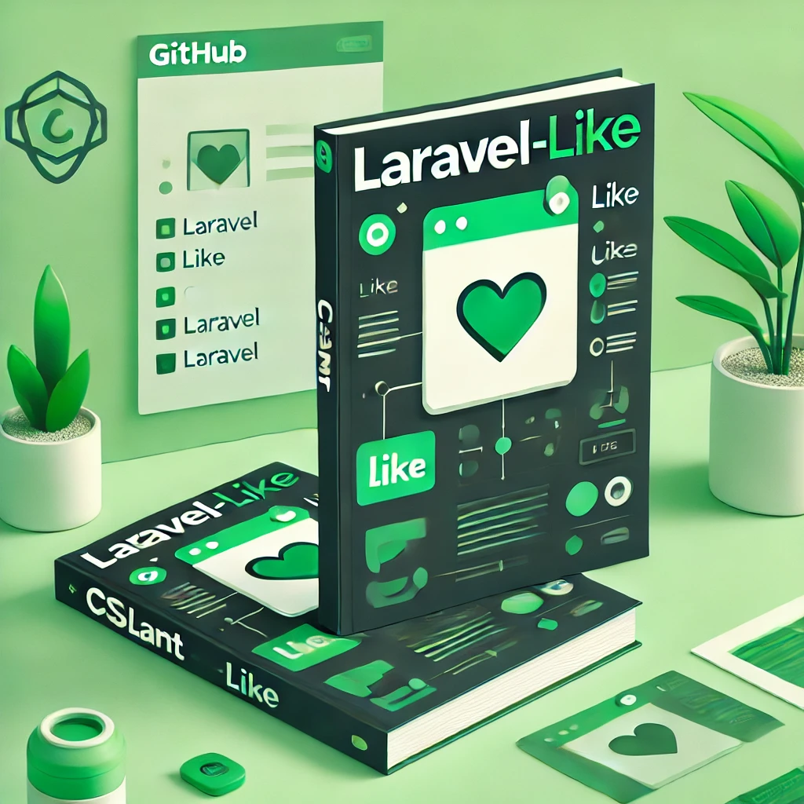

# laravel-like-docs repo

This repository contains the documentation for the Laravel Like projects. The Laravel Like project is a set of Laravel packages that provide additional features and functionalities to Laravel projects.

## Laravel Like Projects

- [Laravel Like Package](https://github.com/cslant/laravel-like)

**Documentation is available at [https://docs.cslant.com/laravel-like](https://docs.cslant.com/laravel-like).**

--- 

## 📢 Issues

If you find yourself stuck using this package, found a bug, or have a feature request. Please open an issue on [GitHub](https://github.com/cslant/laravel-like/issues).

We appreciate detailed and accurate reports that help us identify and replicate the issue.

## 🔥 Feature Requests

If you have any feature requests, please open an issue with the `feature request` label on the [GitHub repository](https://github.com/cslant/laravel-like/issues/new?assignees=&labels=&projects=&template=feature_request.md&title=).
