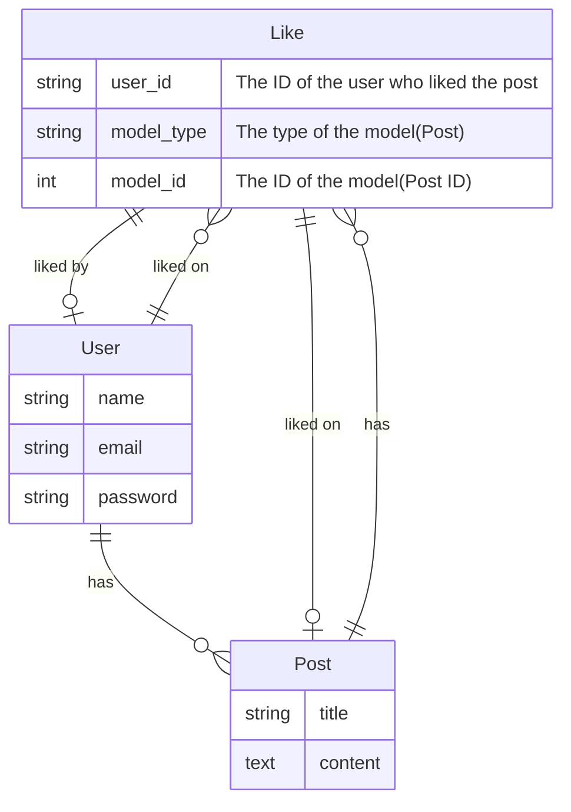
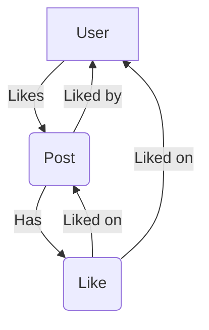

<head>
  <meta name="robots" content="index,follow" />
  <meta name="author" content="CSlant" />
</head>

# 📊 Laravel Like Diagrams and Flow

Here are the diagrams and flow of Laravel Like package. Check out the workflow of Laravel Like package. Understand the flow of Laravel Like package.

## Entity Relationship Diagram (ERD)

The Entity Relationship Diagram (ERD) of Laravel Like package is shown below:

:::info[Explanation of the ERD]

- A `User` can like multiple `Post`s.
- A `Post` can have multiple `Like`s.
- A `User` can have multiple `Like`s.
- A `Like` can be associated with a `User` and a `Post`.

:::

## Laravel Like Flow

The flow of Laravel Like package is shown below:

:::info[Explanation of the flow]

- A `User` likes a `Post`.
- The `Post` is liked by the `User`.
- The `Post` has a `Like`.
- The `Like` is liked on the `User` and the `Post`.

:::

## Conclusion

This is the flow and ERD of Laravel Like package. You can use this information to understand the workflow of Laravel Like package.