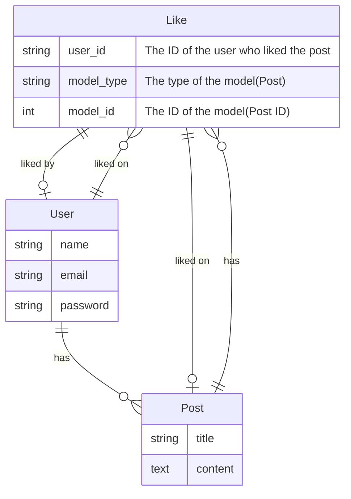
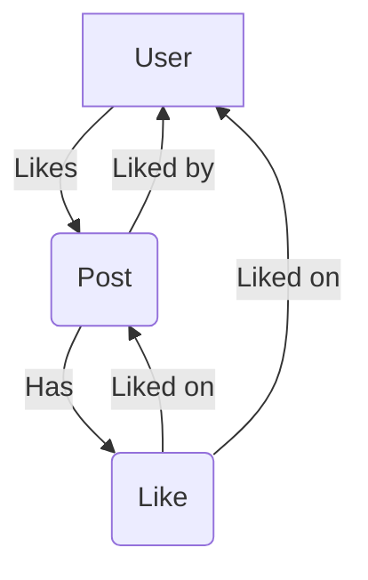

<head>
  <meta name="robots" content="index,follow" />
  <meta name="author" content="CSlant" />
  <meta name="generator" content="Docusaurus" />
  <meta name="theme-color" content="#2e8555" />
  
  <link rel="canonical" href="https://docs.cslant.com/laravel-like/development/laravel-like-flow" />
  
  <meta property="og:title" content="Diagrams and Flow - Laravel Like" />
  <meta property="og:description" content="Workflow of Laravel Like package. Check out the workflow of Laravel Like package. Understand the flow of Laravel Like package." />
  <meta property="og:type" content="article" />
  <meta property="og:url" content="https://docs.cslant.com/laravel-like/development/laravel-like-flow" />
  <meta property="og:site_name" content="Laravel Like Package Documentation" />
  <meta property="og:locale" content="en_US" />
  
  <meta name="twitter:card" content="summary_large_image" />
  <meta name="twitter:title" content="Diagrams and Flow - Laravel Like" />
  <meta name="twitter:description" content="Workflow of Laravel Like package. Check out the workflow of Laravel Like package. Understand the flow of Laravel Like package." />
  <meta name="twitter:creator" content="@cslantofficial" />
  <meta name="twitter:site" content="@cslantofficial" />
  
  <meta name="format-detection" content="telephone=no" />
  <meta name="mobile-web-app-capable" content="yes" />
  <meta name="apple-mobile-web-app-capable" content="yes" />
  <meta name="apple-mobile-web-app-status-bar-style" content="default" />
  
  <meta property="article:published_time" content="2025-07-21T00:00:00Z" />
  <meta property="article:modified_time" content="2025-07-21T00:00:00Z" />
  <meta property="article:author" content="CSlant" />
  <meta property="article:section" content="Documentation" />
  
  </head>

# 📊 Laravel Like Diagrams and Flow

Here are the diagrams and flow of Laravel Like package. Check out the workflow of Laravel Like package. Understand the flow of Laravel Like package.

## Entity Relationship Diagram (ERD)

The Entity Relationship Diagram (ERD) of Laravel Like package is shown below:

:::info[Explanation of the ERD]

- A `User` can like multiple `Post`.
- A `Post` can have multiple `Like`.
- A `User` can have multiple `Like`.
- A `Like` can be associated with a `User` and a `Post`.

:::

## Laravel Like Flow

The flow of Laravel Like package is shown below:

:::info[Explanation of the flow]

- A `User` likes a `Post`.
- The `Post` is liked by the `User`.
- The `Post` has a `Like`.
- The `Like` is liked on the `User` and the `Post`.

:::

## Conclusion

This is the flow and ERD of Laravel Like package. You can use this information to understand the workflow of Laravel Like package.
