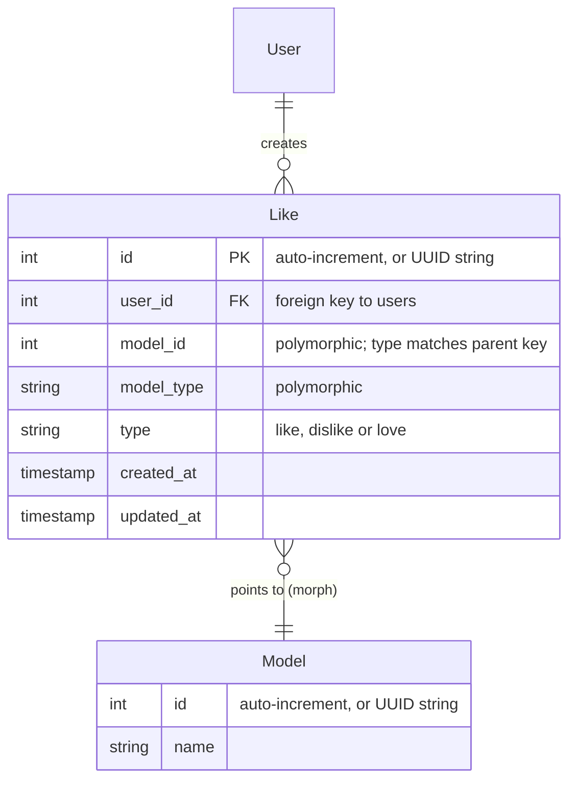
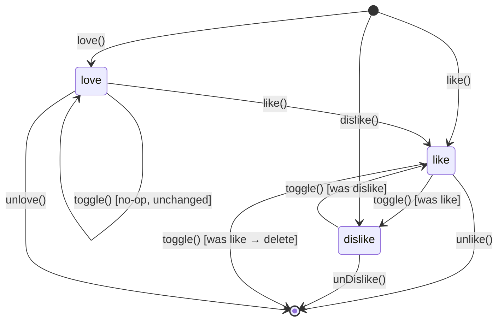
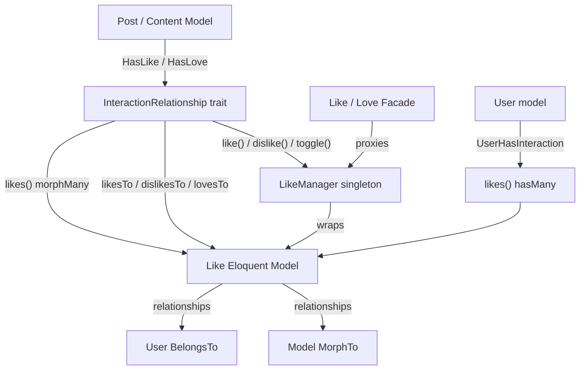

# 📊 Laravel Like — Diagrams and Flow

## Entity Relationship Diagram (ERD)

```mermaid
erDiagram
    User ||--o{ Like : "creates"
    Like }o--|| Model : "points to (morph)"
    Like {
        int id PK "auto-increment, or UUID string"
        int user_id FK "foreign key to users"
        int model_id "polymorphic; type matches parent key"
        string model_type "polymorphic"
        string type "like, dislike or love"
        timestamp created_at
        timestamp updated_at
    }
    Model {
        int id "auto-increment, or UUID string"
        string name
    }
```

### How it works

- A `User` creates zero or more `Like` rows.
- A `Like` is associated with **one concrete model** through a polymorphic `model_id` + `model_type` pair — that model can be a `Post`, `Video`, `Article`, or any other `Model` with the `HasLike` / `HasLove` trait.
- **Single-active invariant:** a unique constraint on `(user_id, model_id, model_type, type)` means one interaction type per user per model at a time.

---

## Interaction lifecycle

```mermaid
stateDiagram-v2
    [*] --> like : like()
    like --> [*] : unlike()
    like --> dislike : toggle()  [was like]
    dislike --> [*] : unDislike()
    dislike --> like : toggle()  [was dislike]
    like --> [*] : toggle()  [was like → delete]
    [*] --> dislike : dislike()
    [*] --> love : love()
    love --> [*] : unlove()
    love --> love : toggle()  [no-op, unchanged]
    love --> like : like()
```

| Current | Action | Result |
| --- | --- | --- |
| *(none)* | `like()` | `LIKE` row created |
| *(none)* | `toggle()` | `LIKE` row created |
| `like` | `toggle()` | Removed — returns `null` |
| `like` | `dislike()` | Old `like` deleted, new `dislike` created |
| `dislike` | `toggle()` | Changed to `like` |
| `love` | `toggle()` | No change — returns existing `love` row |

All mutations above run inside `DB::transaction`.

---

## Component map

```mermaid
graph TD
    A["Post / Content Model"] -- "HasLike / HasLove" --> B["InteractionRelationship trait"]
    B -- "like() / dislike() / toggle()" --> C["LikeManager singleton"]
    B -- "likes() morphMany" --> D["Like Eloquent Model"]
    B -- "likesTo / dislikesTo / lovesTo" --> D
    C -- "wraps" --> D
    E["User model"] -- "UserHasInteraction" --> F["likes() hasMany"]
    F --> D
    G["Like / Love Facade"] -- "proxies" --> C
    D -- "relationships" --> H["User BelongsTo"]
    D -- "relationships" --> I["Model MorphTo"]
```

- **`LikeManager`** — the single service behind all actions; binds as `CSlant\LaravelLike\Contracts\LikeManager`.
- **`Like` model** — the shared interaction record; owns `user()` / `model()` relationships and the `interaction_type` accessor.
- **Facade** — static proxy for convenience; `Like` and `Love` facades point to the same singleton.